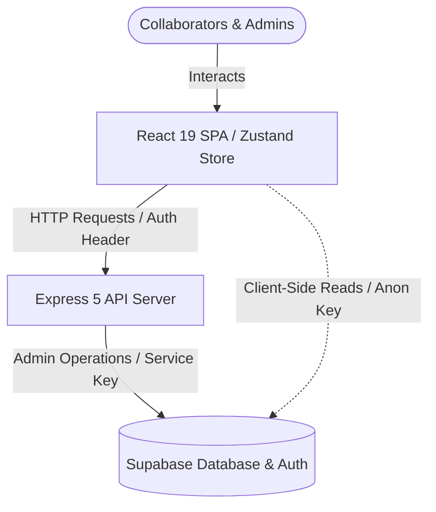

# 🚀 Team Task Manager

[](https://react.dev/)
[](https://expressjs.com/)
[](https://supabase.com/)
[](https://vercel.com/)
[](https://opensource.org/licenses/ISC)

A production-grade, highly responsive, and collaborative Team Task Management Web Application. Built using a modern **monorepo-style architecture** with a React 19 single-page application (SPA) on the frontend, an Express 5 backend server, and Supabase acting as the secure PostgreSQL backend and authentication service.

---

## 🏗️ System Architecture

The application is structured to ensure security and scalability. The frontend never accesses administrative database features directly. Instead, it securely communicates through the Express API layer, which manages permissions using Supabase's Service Role.



---

## ✨ Key Features

- 🔐 **Role-Based Access Control (RBAC):** Supports hierarchical structures: `Main Admin`, `Co-Admin`, and `Member` roles.
- 📁 **Project workspaces:** Create, manage, and assign multiple projects.
- 📋 **Advanced Task Pipeline:** Create tasks, assign due dates, track progression states (`To Do`, `In Progress`, `Done`), and assign tasks directly to team members.
- 📝 **Dynamic Checklists:** Add checklist items to tasks with individual completion states, persisted efficiently in database tables.
- 🔔 **Activity Notifications:** Stay updated with automated triggers for task assignments, project status updates, and administrative overrides.
- ⚡ **Zustand State Management:** Instant responsive state syncing and caching for fluid client-side UI navigation.
- 🌐 **Serverless Deployment Optimized:** Configured for out-of-the-box monorepo deployment on **Vercel** via multi-service route definitions.

---

## 🛠️ Tech Stack

### Frontend
- **Framework:** React 19 & Vite 8 (Ultra-fast HMR build tool)
- **Routing:** React Router DOM v7
- **State Management:** Zustand (Lightweight, hook-based state management)
- **Styling:** Vanilla CSS with custom dynamic UI tokens and theme systems
- **Icons:** Lucide React

### Backend
- **Framework:** Express 5 (Next-gen minimal Node.js framework)
- **Database Connector:** Supabase JS SDK (Service Role integration)
- **Configuration & Security:** dotenv, CORS middleware

### Database & Auth
- **Provider:** Supabase
- **Database Engine:** PostgreSQL
- **Security:** Row Level Security (RLS) policies configured on core tables

---

## 📂 Project Structure

```
team-task-manager/
├── backend/                  # Node.js + Express API Backend
│   ├── src/
│   │   ├── config/           # Supabase SDK Client Configuration
│   │   ├── controllers/      # Route Handler Logic (Auth, Projects, Tasks, Notifications)
│   │   ├── middlewares/      # Authentication & RBAC Role verification middleware
│   │   ├── routes/           # REST Endpoints mapping
│   │   └── scripts/          # Seed scripts (e.g. creating the first Main Admin)
│   ├── server.js             # API entrypoint
│   └── vercel.json           # Serverless deployment configuration
├── frontend/                 # React 19 Frontend
│   ├── src/
│   │   ├── assets/           # Dynamic SVG assets and images
│   │   ├── components/       # Layout, Navbar, and Sidebar UI components
│   │   ├── lib/              # API and Supabase helper modules
│   │   ├── pages/            # View components (Dashboard, Tasks, Projects, Admin Panel)
│   │   ├── store/            # Zustand global stores (auth, tasks, projects)
│   │   ├── styles/           # CSS design systems (theme, core properties)
│   │   ├── App.jsx           # Main routing & layout controller
│   │   └── main.jsx          # Vite client bootstrap
│   ├── index.html            # SPA Entrypoint template
│   └── vercel.json           # Frontend router rewrite configurations
├── supabase_schema.sql       # Database table configurations & policies
├── DEPLOYMENT_ENV.md         # Deployment environment variable reference documentation
├── vercel.json               # Root multi-project service routing
└── package.json              # Monorepo command orchestration scripts
```

---

## 🚀 Local Development Setup

Follow these steps to run the complete environment locally:

### 1. Prerequisites
- **Node.js:** v18.x or higher
- **Supabase Account:** Access to a Supabase project instance

### 2. Clone and Install Dependencies
Navigate into the workspace and run the monorepo-wide installer:
```bash
npm run install:all
```
This script installs packages for the root runner, backend server, and frontend client.

### 3. Setup Supabase Database
1. Go to your **Supabase Dashboard** > **SQL Editor**.
2. Copy the contents of [`supabase_schema.sql`](file:///c:/Users/Piyush/Desktop/new/team-taskmaknger-main/supabase_schema.sql) and paste it into the editor.
3. Run the script. This creates the tables for `users`, `projects`, `tasks`, and `notifications` and configures structural triggers and RLS.

### 4. Configure Environment Variables
Create `.env` files in both the frontend and backend directories:

- **Backend environment config** (`backend/.env`):
  ```env
  PORT=5000
  SUPABASE_URL=https://your-supabase-url.supabase.co
  SUPABASE_SERVICE_ROLE_KEY=your-supabase-secret-service-role-key
  JWT_SECRET=your-chosen-jwt-signing-secret
  ADMIN_EMAIL=admin@taskmanager.com
  ADMIN_PASSWORD=secure-admin-password
  ```

- **Frontend environment config** (`frontend/.env`):
  ```env
  VITE_SUPABASE_URL=https://your-supabase-url.supabase.co
  VITE_SUPABASE_ANON_KEY=your-supabase-public-anon-key
  VITE_API_URL=http://localhost:5000/api
  ```

### 5. Seed the Main Administrator
Run the backend seed script to register your initial Main Admin user in Supabase Auth & public user tables:
```bash
cd backend
node src/scripts/seedAdmin.js
cd ..
```

### 6. Run the Application
Start both the Frontend and Backend concurrently with a single command from the root folder:
```bash
npm run dev
```
- **Frontend** runs on: [http://localhost:5173](http://localhost:5173)
- **Backend API** runs on: [http://localhost:5000](http://localhost:5000)

---

## 🌐 Production Deployment (Vercel)

This workspace is fully optimized for **Vercel** utilizing monorepo configurations. 

1. Push your repository to GitHub.
2. Link the repository root in the Vercel Dashboard.
3. Vercel will automatically parse the root [`vercel.json`](file:///c:/Users/Piyush/Desktop/new/team-taskmaknger-main/vercel.json) file, deploying:
   - The React build to the route `/`
   - The Express application to the route `/api`
4. Add all backend and frontend environment variables under the Project Settings in Vercel as detailed in [`DEPLOYMENT_ENV.md`](file:///c:/Users/Piyush/Desktop/new/team-taskmaknger-main/DEPLOYMENT_ENV.md).

---

## 🔒 Security Guidelines

- **Never disclose `SUPABASE_SERVICE_ROLE_KEY`:** This key bypasses all Row Level Security (RLS) rules and must **only** be stored in your backend environments.
- **Limit CORS in Production:** Update the backend's `cors()` configuration in `server.js` to whitelist your production frontend domain rather than allowing all origins (`*`).
